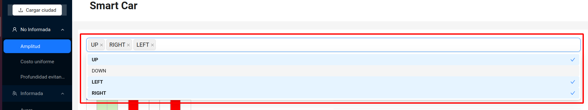

# Smart Car

En una ciudad inteligente un vehículo autónomo debe ubicar a un pasajero y
llevarlo a su destino. La ciudad está representada por medio de una cuadrícula de 10x10 que
contiene las calles, intersecciones y los diferentes tipos de tráfico. En particular, se tienen
tres niveles de tráfico: liviano, medio, y pesado, cada uno de los cuales afecta el costo de la
solución. El objetivo de este proyecto es utilizar algoritmos de búsqueda para ayudar al vehículo
inteligente a localizar al pasajero y encontrar un camino hasta su destino. A continuación, se
presenta una abstracción de una ciudad inteligente.


## Requisitos

- [Docker Compose](https://docs.docker.com/compose/install/)

## Ejecución

Crear las imágenes y ejecutar los contenedores:

```sh
$ docker-compose up -d --build
```

Asegurate de que [http://localhost:5000](http://localhost:5000) y [http://localhost:8080](http://localhost:8080) esten funcionando apropiadamente.

## Uso

Carga tu ciuidad:

**Algunos ejemplos de ciudades en la carpeta [test_files](https://github.com/FSHLL/smart-car/tree/main/test_files)**


Selecciona el algoritmo:


Ajusta el orden de los operadores si lo deseas:



Evalúa la solución:

